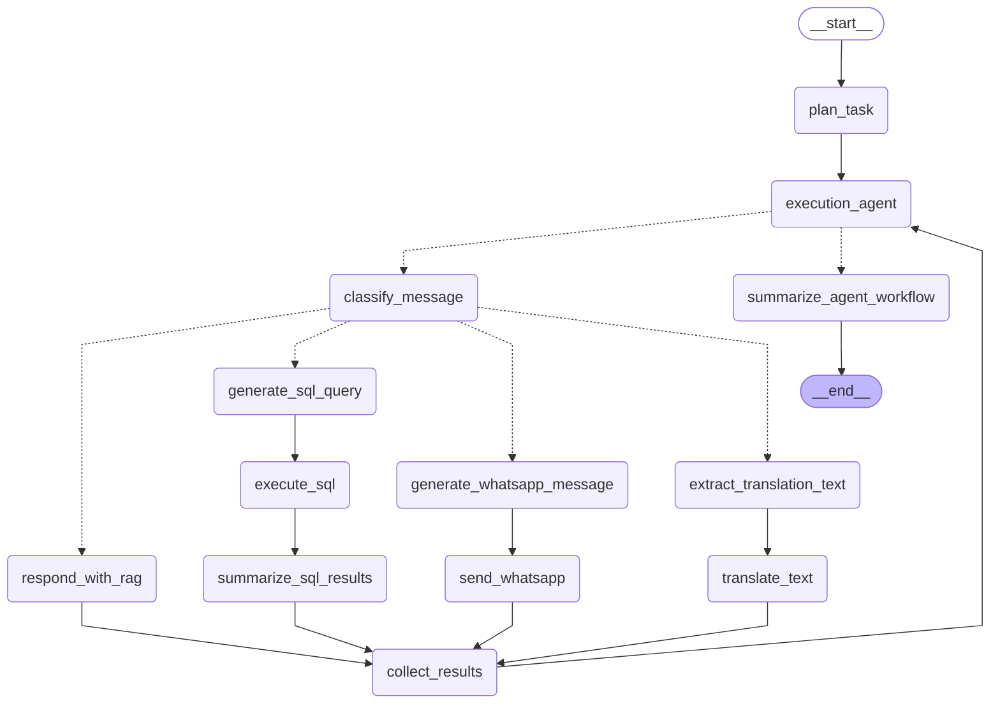

# LangGraph AI Agent 

### Introduction

LangGraph was used as a framework to build an AI agent capable of making decisions autonomously and recursively working on its previous actions. In particular, the agent needed to be able to, from a single query, create a plan, execute instructions from that plan, call on specific tools, and evaluate the results recursively.
LangGraph is an orchestration framework built on top of LangChain, designed for building stateful, multi-step AI workflows. It models the agent's execution as a directed graph, where each node represents a discrete step such as planning, tool execution, or evaluation and edges define the transitions between them. What distinguishes LangGraph from a simple linear chain is its support for conditional branching, allowing the agent to dynamically select the next node based on the current state. For example, routing to a different tool depending on the output of a previous step. LangGraph also maintains a shared state object that is passed between nodes and updated at each step, giving the agent memory of its previous actions within a single execution cycle. This combination of state, conditional branching, and cyclic execution is what enables the agent to plan, act, evaluate, and iterate recursively over its own outputs.
Below is a diagram of the LangGraph workflow, consisting of multiple nodes and sub-agents. The agent is capable of leveraging four core capabilities, RAG (Retrieval-Augmented Generation) for knowledge retrieval, the NLLB translation model for English-Swahili translation, the WhatsApp Cloud API for messaging, and the SQL client for querying the LeadNow database. Each of these capabilities is exposed to the agent as a tool that can be invoked at the appropriate node during execution. The following sections break down each feature and how it integrates into the workflow.




### Agent State

The agent has to keep track of internal state throughout the workflow. Below is a table of the states and their purpose for the agent. 

| State | Explanation | Example |
|-------|-------------|---------|
| `user_id` | Unique identifier for the user | `"user_123"` |
| `phone_number` | Phone number used to resolve the actual user ID for WhatsApp messages | `"+254712345678"` |
| `user_question` | The original user request passed to the planner | `"Check if John completed module 3 and send him a reminder"` |
| `execution_instruction` | The execution agent's directive for the current step, used by the classifier and downstream nodes | `"Send a WhatsApp message to user_123"` |
| `message_type` | The type of tool or message to be used in the current step | `"sql_tool"`, `"whatsapp_tool"`, `"translation_tool"` |
| `plan` | The structured plan generated by the planning sub-agent | `"Step 1: Execute SQL query. Step 2: Send WhatsApp message."` |
| `loop_iteration` | Tracks which step of the plan the execution agent is currently on | `0` (first step), `1` (second step) |
| `total_iterations` | Total number of steps in the plan, more than 5 triggers a fallback to avoid infinite loops | `3` |
| `execution_directive` | Controls routing, `continue` routes to `classify_message`, `end` routes to `summarize_agent_workflow` | `"continue"`, `"end"` |
| `generated_content` | Dictionary storing the inputs, outputs, and responses for each executed step, keyed by iteration index | `{"0": {"sql_query": "SELECT...", "sql_results": [{...}, {...}], "final_tool_response": "James Loke and Jane Doe are both admins"}}` |
| `workflow_summary` | A list of structured summary items, one per executed step | `[{"step": 1, "action": "SQL query", "result": "..."}]` |
| `final_response` | The final response returned to the user after the workflow completes | `"John has not completed module 3. A reminder has been sent."` |

### Planning Sub-Agent

A key capability of the agent is its ability to generate a structured plan from a single query. For example, if an education officer wanted to check whether a user has completed a module and then send them a WhatsApp reminder, this can be accomplished in a single query rather than two separate requests. This is handled by a planning sub-agent, which takes in the user query, decomposes the query into an ordered sequence of steps, and outputs a plan. In the above example, first executing an SQL query to check module completion, then sending a WhatsApp message with the result. Beyond dynamic planning, the planning sub-agent is also prompt engineered for common education officer tasks identified by Dignitas, including preparation for school visits, lesson observation checklists, post-visit documentation, and zone reviews. This means the agent has built-in awareness of recurring workflows, allowing it to produce more accurate and contextually relevant plans for the tasks education officers perform most frequently. The prompt in the code snippet below has been shortened for brevity.

```python
class PlanningAgentNodes:

    def __init__(self, chat_service: ChatService):
        self.chat_service = chat_service

    def plan_task(self, state: Dict[str, Any]) -> Dict[str, Any]:

        user_question = state["user_question"]
        system_prompt = """

REQUEST TYPE IDENTIFICATION AND PLANNING RULES:

**Type 1 — School Visit Preparation**
Triggered by: requests to prepare for / plan a visit to a school.
Plan steps:
- If use did NOT specify a school name:
    1. **Identify School (SQL)**: Query to list schools in the EO's cohort/zone and ask them to select one. STOP.
- If user DID specify a school name:
    1. **Gather Data (SQL)**: Query for the specific school's data:
       - Identify 1-2 priority teachers based on low module completion (status=0, scenario_score>0) or low assessment scores.
       - For these teachers, find which modules they are struggling with or haven't started.
    2. **Generate Plan (Coaching tool)**: Use the coaching tool to generate a "School Visit Plan" using the retrieved data.

**Type 2 — Lesson Observation Checklist**
Triggered by: requests for observation checklists, look-fors, or criteria for a competency.
Plan steps:
- If competency IS specified (or implied by a module name):
    1. **Generate Checklist (Coaching tool)**: Use the coaching tool to generate an "Observation Checklist" for the competency stated in the request.

**Type 3 — Post-Visit Documentation**
Triggered by: requests to write up, summarize, or document a visit/coaching session.
Plan steps:
1. **Synthesize Note (Coaching tool)**: Use the coaching tool to generate a "School Visit Coaching Note".
   - If details (School Name, Date, Teachers Met, Observations) are missing, the tool will prompt for them.

**Type 4 — Zone / Weekly Review**
Triggered by: requests for zone priorities, weekly overview, zone insights, "how is my zone doing".
Plan steps:
1. **Identify Zone (SQL)**: Query to find or confirm the user's zone.
2. **Get Diagnostics (SQL)**: Query for comprehensive zone performance metrics (e.g. Low Completion Schools, Stagnating Competencies, Data Issues).
3. **Generate Review (Coaching tool)**: Use the coaching tool to generate a "Weekly Zone Review" using these metrics.

**Type 5 — Data Retrieval / General**
Triggered by: Specific data queries (e.g. "who are the teachers in X", "data for school Y"), general questions, greetings, translation.
Plan steps:
- If request is for data/info:
    1. **Retrieve Data (SQL)**: Use SQL to query the specific information requested.
- If request is general/other:
    1. **Respond (RAG/General)**: Use appropriate tool (Translation, WhatsApp, RAG) to answer directly.


."""

        user_prompt = "User request: {user_question}"
        prompt = Prompt(system_prompt, user_prompt)

        result: TaskPlan = self.chat_service.respond_with_history(
            user_id=state["user_id"],
            service_id="general_agent",
            prompt=prompt,
            question=user_question,
            structured_output=TaskPlan,
        )

        plan_text = result.plan
        return {"plan": plan_text}
```

### Execution Sub-Agent

The execution sub-agent takes in the plan, identifies the current step via `loop_iteration`, crafts a precise execution instruction for that step, and routes it to the classifier for execution. On each loop-back, it collects the result of the completed step and decides whether to continue to the next step or end the workflow. At each iteration, the execution sub-agent reads `plan`, `loop_iteration`, `final_response`, `execution_directive`, and `generated_content` from the shared state. Depending on the outcome, it writes back `execution_instruction` (when continuing to the next step), `execution_directive` (`"continue"` or `"end"`), `loop_iteration`, and `generated_content` or `final_response` when ending the workflow. The execution sub-agent also incorporates a retry mechanism if a step returns a failed result, it revises the classifier message and retries up to 2 times before recording the failure and moving on. A hard cap of 5 total iterations is enforced to prevent the agent from entering an endless cycle and consuming excessive tokens. Once the plan is fully executed, the agent routes to the summarise workflow node, which aggregates all step results and synthesises a final cohesive response to return to the education officer. The code below has been shortened and summarised for brevity.

```python
class ExecutionAgentNodes:

    MAX_STEP_RETRIES = 2

    def execution_agent(self, state: Dict[str, Any]) -> Dict[str, Any]:
        plan = state.get("plan", "")
        loop_iteration = state.get("loop_iteration", 0)
        execution_directive = state.get("execution_directive", "")
        generated_content = dict(state.get("generated_content", {}))

        # ① INITIAL CALL — craft classifier message for step 1
        if not execution_directive:
            response = self.chat_service.respond(
                system_prompt="...produce a classifier message for step 1 of the plan...",
                user_message=f"Request: {state['user_question']}\nPlan:\n{plan}",
            )
            return {
                "execution_instruction": response.strip(),
                "execution_directive": "continue",
                "loop_iteration": 0,
                "total_iterations": 0,
            }

        # ② LOOP-BACK — check iteration cap
        total_iterations = state.get("total_iterations", 0) + 1
        if total_iterations > 5:
            return {"execution_directive": "end", "generated_content": generated_content}

        # ② a FAILURE DETECTED — retry up to MAX_STEP_RETRIES
        step_data = dict(generated_content.get(str(loop_iteration), {}))
        previous_result = step_data.get("final_tool_response", "")
        if self._is_failed_result(previous_result):
            retry_count = step_data.get("_retries", 0)
            if retry_count < self.MAX_STEP_RETRIES:
                revised = self.chat_service.respond(
                    system_prompt="...revise the classifier message for the failed step...",
                    user_message=f"Plan:\n{plan}\nFailed result:\n{previous_result}",
                )
                return {"execution_instruction": revised.strip(), "execution_directive": "continue"}

        # ② b DECIDE: CONTINUE OR END
        decision: ExecutionDecision = self.chat_service.respond(
            system_prompt="...decide continue or end, craft next step instruction...",
            user_message=f"Plan:\n{plan}\nResults:\n{generated_content}",
            structured_output=ExecutionDecision,
        )
        if decision.action == "end":
            return {"execution_directive": "end", "generated_content": generated_content}

        return {
            "execution_instruction": decision.message,
            "execution_directive": "continue",
            "loop_iteration": loop_iteration + 1,
            "total_iterations": total_iterations,
            "generated_content": generated_content,
        }

    def execution_router(self, state: Dict[str, Any]) -> str:
        return state.get("execution_directive", "continue")

    def summarize_agent_workflow(self, state: Dict[str, Any]) -> Dict[str, str]:
        # Build per-step workflow summary
        workflow_summary_obj: WorkflowSummary = self.chat_service.respond(
            system_prompt="...summarize each executed step...",
            user_message=f"Plan:\n{state['plan']}\nResults:\n{state['generated_content']}",
            structured_output=WorkflowSummary,
        )
        # Synthesize final response
        final_response = self.chat_service.respond_with_json_input(
            user_id=state["user_id"],
            service_id="general_agent",
            prompt=Prompt("...synthesize all step results into a cohesive response..."),
            input_dict={"plan": state["plan"], "generated_content": state["generated_content"]},
        )
        return {
            "final_response": final_response,
            "workflow_summary": [s.model_dump() for s in workflow_summary_obj.steps],
        }

```

### Classify Task
If the execution agent decides to continue, it creates a classifier message which is sent to the **message classifier** node. The message classifier uses structured outputs via a `MessageClassifier` Pydantic model to categorise the instruction into one of five tool types: `sql_tool`, `whatsapp_tool`, `translation_tool`, `coaching_tool`, or `user`. The classification is then used by the router to direct execution to the appropriate downstream node.

For `user` type messages, the agent responds using **RAG (Retrieval-Augmented Generation)**. The instruction is passed to `respond_with_rag`, which queries the Qdrant vector store for relevant context and uses it to generate a grounded, context-aware response. 

```python 
class GeneralNodes:
    """General conversation nodes that use ChatService for RAG-enabled responses."""
    
    def __init__(self, chat_service: ChatService):
        self.chat_service = chat_service
    
    def classify_message(self, state: Dict[str, Any]) -> Dict[str, str]:
        logger.info(f"Classifying message for user {state['user_id']}")
        
        # Use execution_instruction if set by execution agent, otherwise fall back to user_question
        message_to_classify = state.get("execution_instruction") or state["user_question"]
        logger.info(f"[CLASSIFIER] Classifying: {message_to_classify!r}")
        
        system_prompt = """You are a message classifier. Classify the user's message into ONE category:

- user: General chat, responses, or requests to ASK/INFORM/CLARIFY something with the user.
- translation_tool: Translate text.
- whatsapp_tool: Send a WhatsApp message.
- sql_tool: Query/Find/Check database for raw information/data (e.g. "Find schools", "Get diagnostics", "Show metrics", "List teachers").
- verification_tool: ONLY for explicit account verification requests (e.g. "check my status", "who am i", "verify").
- coaching_tool: Generate structured PLANS, DOCUMENTS or REPORTS based on data (e.g. "Create a visit plan", "Write a review", "Generate checklist").

IMPORTANT:
- If the request is to GET/FIND/RETRIEVE specific data points, metrics, or diagnostics, use `sql_tool`.
- If the request is use that data to WRITE/GENERATE a formatted document, use `coaching_tool`.

Return the appropriate message_type.
"""
        
        # Use ChatService with structured output parameter
        result: MessageClassifier = self.chat_service.respond(
            system_prompt=system_prompt,
            user_message=message_to_classify,
            structured_output=MessageClassifier
        )
        
        message_type = result.message_type
        logger.info(f"[CLASSIFIER] Message classified as: {message_type}")
        
        return {"message_type": message_type}
    
    def router(self, state: Dict[str, Any]) -> str:
        message_type = state["message_type"]
        
        routing_map = {
            "user": "respond_with_rag",
            "whatsapp_tool": "generate_whatsapp_message",
            "sql_tool": "generate_sql_query",
            "translation_tool": "extract_translation_text",
            "verification_tool": "verify_education_officer",
            "coaching_tool": "classify_coaching_task",
        }
        
        next_node = routing_map.get(message_type, "respond_to_user")
        logger.info(f"[MAIN ROUTER] {message_type} -> {next_node}")
        return next_node
    
    def respond_with_rag(self, state: Dict[str, Any]) -> Dict[str, Any]:
        logger.info(f"Generating RAG response for education officer {state['user_id']}")
        
        step_str = str(state.get("loop_iteration", 0))
        # Use execution_instruction (step directive) if available, otherwise original question
        user_question = state.get("execution_instruction") or state["user_question"]
        
        system_prompt = """You are an assistant for LeadNow, an educational app for coaching education officers 
in Kenya.

Your goal is to answer the user's question helpfuly using the provided context.
If no context is found, use your general knowledge but mention that it is general advice.

Keep answers concise, professional, and supportive."""
        
        user_prompt = "User question: {user_question}"
        
        prompt = Prompt(system_prompt, user_prompt)
        
        # Use respond_with_history for RAG support
        response = self.chat_service.respond_with_history(
            user_id=state["user_id"],
            service_id="general_agent",
            prompt=prompt,
            question=user_question,
            use_rag=True,
            rag_k=3
        )
        
        logger.info("Generated RAG response")
        
        # Return structured for generated_content
        return {
            "final_response": response,
            "generated_content": {step_str: {"final_tool_response": response}}
        }

```

### Translation Tool Workflow

The translation workflow consists of two nodes. First, `extract_translation_text` uses an LLM call to extract the text to be translated from the execution instruction and stores it in generated_content. Second, `translate_text_node` retrieves this extracted text and passes it to the NLLB translation model via the MCP client, storing the translated result back into `generated_content` as `final_tool_response`.

```python 
class TranslationNodes:
    """Translation parameter extraction and translation nodes."""
    
    def __init__(self, chat_service: ChatService):
        self.chat_service = chat_service
    
    def extract_translation_text(self, state: Dict[str, Any]) -> Dict[str, str]:
        
        # Use execution_instruction if set by execution agent, otherwise use user_question
        message_to_process = state.get("execution_instruction") or state["user_question"]
        
        system_prompt = """You are a translation parameter extractor. 
          From the user's request, extract:
          1. The text to translate

          Respond in format:
          [text to translate]
        """
        
        extracted = self.chat_service.respond(
            system_prompt=system_prompt,
            user_message=message_to_process
        )
        
        logger.info("Extracted translation parameters")
        
        # Store translation text in generated_content dictionary
        step_str = str(state.get("loop_iteration", 0))
        generated_content = state.get("generated_content", {})
        new_gc = merge_generated_content(
            generated_content,
            {step_str: {"translation_text": extracted}}
        )
        return {"generated_content": new_gc}
    
    async def translate_text_node(self, state: Dict[str, Any]) -> Dict[str, Any]:
        
        # Retrieve translation text from generated_content dictionary
        step_str = str(state.get("loop_iteration", 0))
        generated_content = state.get("generated_content", {})
        generated = generated_content.get(step_str, {})
        text_to_translate = generated.get("translation_text")
        
        # Call MCP client to translate the text
        result = await mcp_translate_text(text=text_to_translate, direction="english_to_swahili")
        new_gc = merge_generated_content(
            generated_content,
            {step_str: {"final_tool_response": result}}
        )
        return {"generated_content": new_gc}
```

### WhatsApp Tool Workflow

The WhatsApp workflow consists of two nodes. First, `generate_whatsapp_message` uses a structured LLM call to extract the recipient's phone number from the execution instruction and determine whether to send a template message or a regular message, template messages are used for reminders and bulk notifications (e.g. module completion reminders), while regular messages are used for personal or conversational content. The extracted details are stored in `generated_content`. Second, `send_whatsapp` retrieves these details and routes to either `send_whatsapp_template` or `send_whatsapp` via the MCP client depending on the `use_template` flag. A phone number validation check is performed before any call is made, returning an error into `generated_content` if no valid number is found. The result of the MCP call is stored back into `generated_content` as `final_tool_response`.

``` python 

class WhatsAppNodes:
    """WhatsApp message generation and sending nodes."""
    
    def __init__(self, chat_service: ChatService):

        self.chat_service = chat_service
        logger.info("WhatsApp nodes initialized - will use FastMCP server")
    
    def generate_whatsapp_message(self, state: Dict[str, Any]) -> Dict[str, Dict[str, Any]]:

        logger.info(f"Generating WhatsApp message for user {state['user_id']}")
        
        # Use execution_instruction if set by execution agent, otherwise use user_question
        message_to_process = state.get("execution_instruction") or state["user_question"]
        current_date = datetime.now()
        day_name = current_date.strftime("%A")
        date_str = current_date.strftime("%B %d, %Y")

        system_prompt = f"""
    You are a WhatsApp message assistant for LeadNow education platform.

    Analyze the user's request and determine:
1. Should this use a TEMPLATE message or REGULAR text message?
   - Use TEMPLATE for: reminders, notifications, bulk messages to teachers/students
   - Use REGULAR for: personal messages, custom content, conversational messages
   
2. Extract recipient's phone number (use 'unknown' if not provided)

3. If TEMPLATE: identify the template name and extract parameters
   Available templates:
   - 'module_reminder': For module completion reminders [params: module_name, deadline]
     * module_name: Extract from user request (e.g., "Module 1", "Leadership Training")
     * deadline: Extract if mentioned, OR generate sensible default like:
       - "end of this week"
   - 'hello_world': Simple test template [params: none]
   
4. If REGULAR: generate professional WhatsApp message content

"""
        # Use structured output to parse phone number, template detection, and message
        extraction: WhatsAppExtraction = self.chat_service.respond(
            system_prompt=system_prompt,
            user_message=message_to_process,
            structured_output=WhatsAppExtraction
        )
      
        
        # Store extraction results in generated_content dictionary
        step_str = str(state.get("loop_iteration", 0))
        generated_content = state.get("generated_content", {})
        new_gc = merge_generated_content(
            generated_content,
            {step_str: {
                "use_template": extraction.use_template,
                "phone_number": extraction.phone_number,
                "template_name": extraction.template_name,
                "template_parameters": extraction.template_parameters or [],
                "whatsapp_message": extraction.message
            }}
        )
        return {
            "generated_content": 
            new_gc
        }
    
    async def send_whatsapp(self, state: Dict[str, Any]) -> Dict[str, Any]:

        
        # Retrieve details from generated_content dictionary
        step_str = str(state.get("loop_iteration", 0))
        generated_content = state.get("generated_content", {})
        generated = generated_content.get(step_str, {})
        use_template = generated.get("use_template", False)
        phone_number = generated.get("phone_number", "unknown")
        template_name = generated.get("template_name")
        template_parameters = generated.get("template_parameters", [])
        message_content = generated.get("whatsapp_message", "Hello!")
        # Choose between template and regular message
        if use_template and template_name:
            # Send template message
            
            # Convert list to comma-separated string for MCP
            params_str = ",".join(str(p) for p in template_parameters) if template_parameters else ""
            
            result = await send_whatsapp_template(
                phone_number=phone_number,
                template_name=template_name,
                language="en",  # Use "en" for module_reminder, "en_US" for hello_world
                parameters=params_str
            )

            new_gc = merge_generated_content(generated_content, {step_str: {"final_tool_response": result}})
            return {"generated_content": new_gc}
        else:
            # Send regular text message
            result = await send_whatsapp(
                phone_number=phone_number,
                message=message_content
            )
            
            new_gc = merge_generated_content(generated_content, {step_str: {"final_tool_response": result}})
            return {"generated_content": new_gc}
```

### SQL Tool Workflow
The SQL workflow consists of three nodes. First, `generate_sql_query` uses an LLM call with a detailed system prompt that includes the full LeadNow database schema, all table names, column definitions, and key relationships, to convert the natural language execution instruction into a raw SQL SELECT query. The prompt also includes explicit rules around module completion logic, cohort filtering, and join patterns to handle the complexity of the LeadNow data model. The generated query is stored in `generated_content`.
Second, `execute_sql` retrieves the generated query from `generated_content` and executes it via the MCP SQL client, storing the raw results back into `generated_content`.
Third, `summarize_sql_results` passes the raw results and the original question to an LLM call, which analyses the data and produces a concise, user-friendly summary of the key insights. The final output then combines the LLM insights and the raw data, and is stored as `final_tool_response` in `generated_content` for the execution agent to collect. The code has been shortened for brevity

```python
class SQLNodes:
    """SQL query generation and execution nodes."""
    
    def __init__(self, chat_service: ChatService):

        self.chat_service = chat_service
    
    def generate_sql_query(self, state: Dict[str, Any]) -> Dict[str, str]:
  
        # Use execution_instruction if set by execution agent, otherwise use user_question
        question = state.get("execution_instruction") or state["user_question"]

        system_prompt = """You are a SQL query generator for the LeadNow database.
Convert the user's natural language question into a safe SQL SELECT query.

Context:  They belong to cohorts managed by education officers.
Modules are teaching topics assigned to cohorts.

## Core Tables

**users** - id, name, mobile
**edu_officers** - id, user_id→users, cohort_id→cohorts
**cohorts** - id, name
**clients** - id, user_id→users, cohort_id→cohorts, client_id → clients, school_id→schools, email, gender, role, title
    There are different roles, some of them are 'Class Teacher', 'Deputy', 'Deputy Head Teacher', 'Director', 'Grade 1 Teacher', 'Grade 2 Teacher', 'Grade 3 Teacher', 'Head Teacher', 'Headteacher', 'Instructional Leader', 'School Leader Teacher', 'Teacher'
**cohort_module** - id, cohort_id→cohorts, module_id→leadnow_modules
**leadnow_modules** - id, module_number, module_name, intro_page_content, objectives, how_to_guide_what, how_to_guide_why, emerging_content, intermediate_content, mastery_content, advanced_content, ermerging recommendation, intermediate recommendation, mastery recommendation, advanced recommendation
**user_modules** - id, user_id→users, module_id→leadnow_modules, post_module_assessment_score, pre_module_assessment_score, scenario_score, action_plan, status (0 = completed/not-started, 1 = in progress)

PLEASE USE BOTH STATUS AND SCENARIO_SCORE TO CHECK IF A MODULE IS NOT STARTED vs COMPLETED vs IN PROGRESS:
IMPORTANT: To filter if a user has not started a module, check if their status = 0 and scenario_score = 0
To filter if a user has completed a module, check if their status = 0 AND scenario_score > 0
To filter if a user has a module in progress, check if their status = 1
When calculating module completion rates, only include modules assigned to the teacher’s cohort using cohort_module.

"""
        user_prompt = "User question: {user_question}. The requesting user id is {user_id}. "

        phone_number = state.get("phone_number")
        # Check if phone_number is truthy and not "None" string
        if phone_number and str(phone_number).lower() != "none":
            id_or_phone = f"We are using a PHONE NUMBER: {phone_number}"
        else:
            id_or_phone = state["user_id"]

        prompt = Prompt(system_prompt, user_prompt)
        
        sql_query = self.chat_service.respond_with_history(
            user_id=id_or_phone,
            service_id="general_agent",
            prompt=prompt,
            question=question,
            use_rag=False
        )

        step_str = str(state.get("loop_iteration", 0))
        existing_gc = state.get("generated_content", {})
        new_gc = merge_generated_content(existing_gc, {step_str: {"sql_query": sql_query}})
        return {"generated_content": new_gc}
    
    async def execute_sql(self, state: Dict[str, Any]) -> Dict[str, Any]:
        # Retrieve SQL query from generated_content dictionary
        step_str = str(state.get("loop_iteration", 0))
        generated = state.get("generated_content", {}).get(step_str, {})
        sql_query = generated.get("sql_query", "SELECT * FROM users LIMIT 10")
        
        # Execute SQL using MCP client
        try:
            result = await execute_sql(sql_query)
            # Store raw results in generated_content (preserving prior fields for this step)
            existing_gc = state.get("generated_content", {})
            new_gc = merge_generated_content(
                existing_gc,
                {step_str: {"sql_results": result}},
            )
            return {"generated_content": new_gc}
        except Exception as e:
            logger.error(f"Error executing SQL: {str(e)}")
            error_msg = f"Error executing SQL: {str(e)}"
            existing_gc = state.get("generated_content", {})
            new_gc = merge_generated_content(existing_gc, {step_str: {"sql_results": error_msg}})
            return {"generated_content": new_gc}

    def summarize_sql_results(self, state: Dict[str, Any]) -> Dict[str, Any]:
        
        # Use execution_instruction if set by execution agent, otherwise use user_question
        question = state.get("execution_instruction") or state["user_question"]
        
        # Get raw SQL results
        step_str = str(state.get("loop_iteration", 0))
        generated = state.get("generated_content", {}).get(step_str, {})
        sql_results = generated.get("sql_results", "[]")
        
        # Parse if string, otherwise use as-is
        try:
            if isinstance(sql_results, str):
                results_data = json.loads(sql_results)
            else:
                results_data = sql_results
        except json.JSONDecodeError:
            results_data = []
        
        system_prompt = """You are a data analyst. Analyze the SQL query results and provide:
1. Key insights and summary of the data
2. Any notable patterns or findings
3. Direct answer to the user's original question

Be concise and clear. Focus on what matters to the user."""
        
        user_prompt = """Original question: {user_question}

SQL Results:
{results_json}

Provide a clear summary and insights."""

        prompt = Prompt(system_prompt, user_prompt)

        llm_insights = self.chat_service.respond_with_json_input(
            user_id=state["user_id"],
            service_id="general_agent",
            prompt=prompt,
            input_dict={
                "user_question": question,
                "results_json": json.dumps(results_data, indent=2)
            },
            use_rag=True
        )
        
            
        # Combine LLM insights with raw data
        final_output = {
            "insights": llm_insights,
            "raw_data": results_data
        }
        
        existing_gc = state.get("generated_content", {})
        new_gc = merge_generated_content(existing_gc, {step_str: {"final_tool_response": json.dumps(final_output, indent=2)}})
        return {"generated_content": new_gc}
```

### Coaching Tool Workflow (Lincoln writes this)

