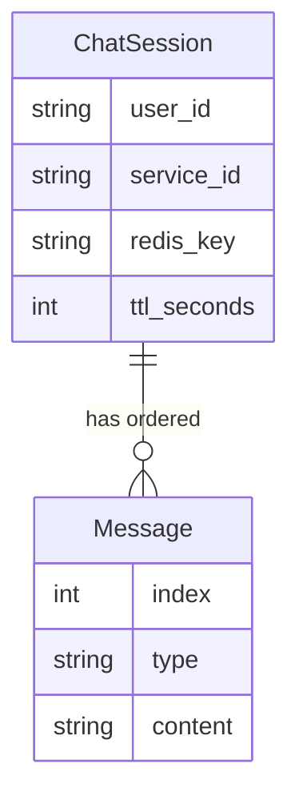
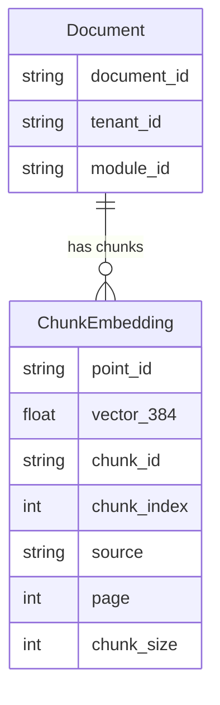

# Class Diagrams & Data Storage

## Class Diagrams

We will be using UML diagrams to illustrate the object oriented design of our system.

We adopted an object-oriented programming approach to design the LLM component for the educational assistant chatbot. The LLM component is centred around the ChatService, which orchestrates prompt handling, conversation memory, retrieval augmented generation (RAG)context retrieval and response generation. User input is encapsulated within the Prompt value object, which standardises system and user prompts before being passed to the service. ChatService integrates with an external LLM client to generate responses and composes RedisHistory objects to manage conversation memory. For RAG, ChatService is associated with supporting components such as QdrantUploader which itself is associated with TextEmbedder. QdrantUploader handles vector storage while Text Embedder embedding generation respectively. Below is the UML diagram for the LLM component

Additionally, we also used an object oriented approach to designing other external services. Below is the UML diagram for these components.

The external services component integrates key third-party and infrastructure services required by the system. The WhatsAppClient handles communication with the WhatsApp Cloud API, enabling the application to send text and template messages. The TranslationService provides multilingual support by translating between English and Swahili using a machine translation model, while the TranscriptionService enables audio processing by converting speech into text using a trained speech recognition model. In addition, the SQLClient manages structured data storage and retrieval through synchronous and asynchronous database connections.

For the education officer agent, the LangGraph library was used to design and orchestrate complex workflows using an object-oriented, graph-based approach. Below is the UML diagram.

The LangGraph UML diagram represents the education officer agent as a state-driven workflow, where the GeneralAgent orchestrates a series of specialised nodes connected through directed edges. The shared AgentState enables information to flow between nodes, ensuring each step builds on the previous one. The GeneralNodes handle initial processing such as classifying user input and routing requests to the appropriate pathway, including retrieval-augmented generation. The PlanningAgentNodes are responsible for breaking down complex user requests into structured plans or step-by-step instructions. The ExecutionAgentNodes then carry out these plans, iterating through steps, managing retries, and producing structured outputs or summaries of the workflow. The WhatsAppNodes manage message formatting and interaction with the WhatsApp service, enabling responses to be sent to users, while the TranslationNodes handle language translation tasks to support multilingual communication. Additionally, SQLNodes enable the generation and execution of database queries when structured data access is required.

Other classes support system functionality such as data validation, error handling, and configuration. The schemas module defines Pydantic models to enforce consistent API request and response structures. The errors module provides structured exceptions for handling specific failure cases, while the config module centralises environment-based settings. Additionally, a custom logger standardises logging across the system, improving maintainability and debugging.

## Data Storage

In terms of data storage, we had to connect to the pre-existing MySQL database. This SQL database is extremely large with 62+ tables, so for this website report we will only highlight the main tables. Below is the ER diagram.

For data storage that we introduced for our project however, we introduced data storage in the forms of a NoSQL in-memory key-value data store of Redis and a vector database of Qdrant.

Redis is used to maintain context of the user's previous messages with the educational assistant LLM. Each conversation is scoped to a unique `(user_id, service_id)` pair and stored under a key of the form `chat_history:{user_id}:{service_id}`. The data is stored as a Redis LIST, where each element represents a single message in the conversation. Messages are serialized as JSON objects from LangChain’s BaseMessage, and contain fields such as type (e.g., human, AI) and content. The list also preserves message order, allowing the system to reconstruct the full conversation history. Additionally, Redis applies a TTL of 180 seconds and is refreshed on read and write operations. Therefore, if a user does not chat to the educational assistant, the message history will be removed. This can be modelled as a one-to-many relationship where a `ChatSession` contains an ordered list of `Message` entities.

Qdrant is used as a persistent vector database to store document embeddings for retrieval. The main collection, leadnow_documents, contains vector embeddings of LeadNow resources document chunks along with associated metadata. Each entry represents a chunk of a document and includes a unique `point_id`, a vector[384] `embedding`, metadata fields such as `document_id`, `chunk_id`, `chunk_index`, `source`, `page`, and `chunk_size` and optional fields like `tenant_id` and `module_id`. Conceptually the schema consists of a Document entity and a ChunkEmbedding entity, where each document is associated with multiple chunk embeddings.

