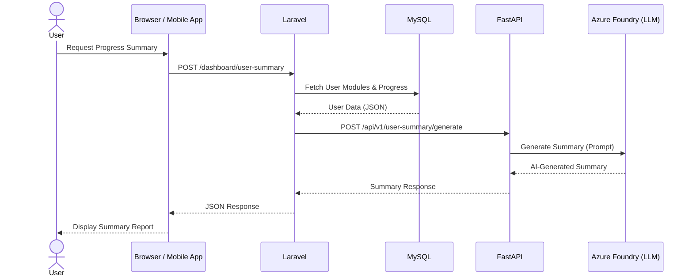
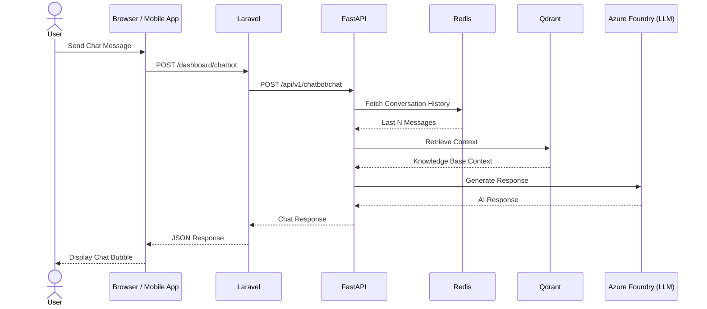
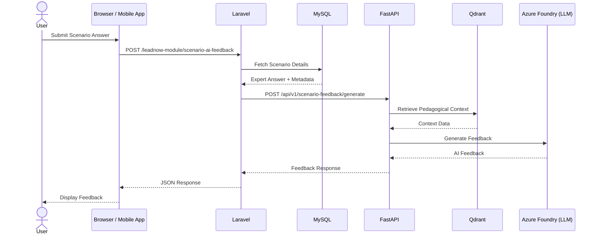
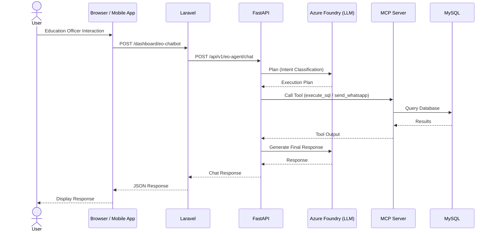
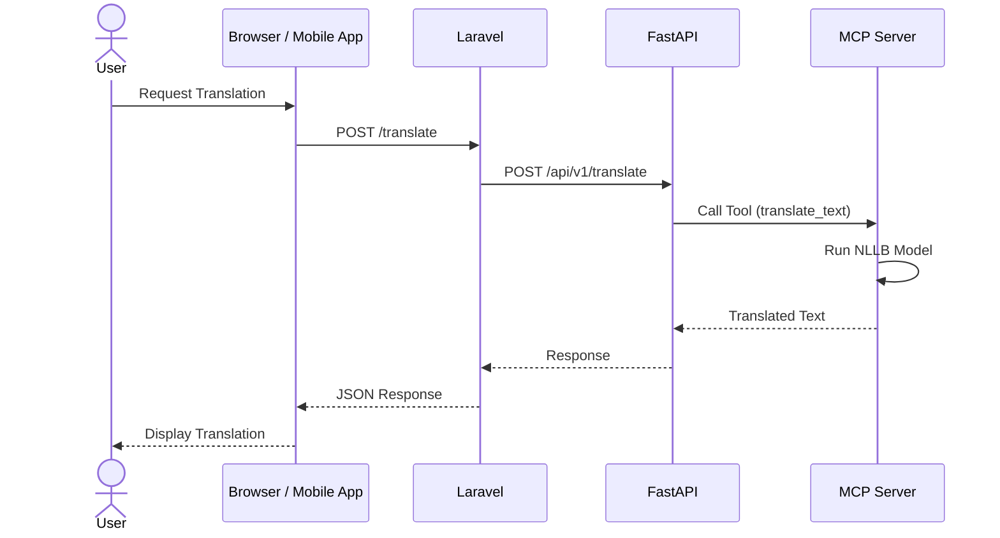
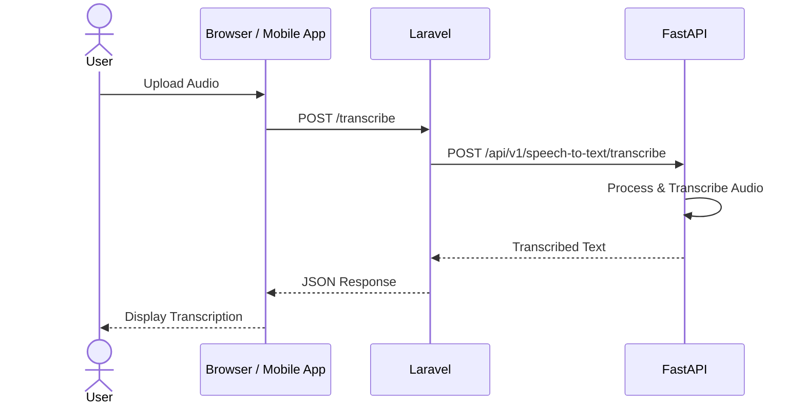

# Sequence Diagram & Site Map

## Sequence Diagram

The system is built with a client (browser/mobile app), Laravel backend, FastAPI services, and supporting infrastructure (databases, vector store, and AI services). Each feature follows a request-response pattern where user actions trigger backend processing, often involving AI models and data retrieval, before returning results to the user. Sequence diagrams were built for the following key features:

1. User Progress Summary Generation
 Generates a summary of a user’s learning progress using stored module and performance data, enhanced with AI-generated insights.

2. AI Chatbot (General Education Assistant)
 Provides interactive support by responding to user queries using conversational history and contextual knowledge retrieval.

3. Personalised Scenario Feedback
 Evaluates user-submitted answers to scenarios and provides structured, AI-generated feedback based on expected solutions and pedagogical context.

4. Education Officer Agent
 An intelligent assistant that can perform multi-step tasks such as querying databases and sending messages (e.g. via WhatsApp), using AI planning and tool execution.

5. English to Swahili Translation
 Converts text from English to Swahili using a dedicated translation model served through a tool-based architecture.

6. Speech-to-Text Transcription
 Converts audio input into written text through backend processing and transcription services.

The components of this sequence diagram are
- User
- Browser / Mobile App (Client)
- Laravel
- FastAPI
- MySQL
- Redis
- Qdrant
- MCP Server
- Azure Foundry (LLM)

Across all features, the system follows a consistent pattern:
1. The user initiates an action via the client.
2. The request is routed through Laravel.
3. FastAPI handles AI-related processing.
4. Supporting systems (MySQL, Redis, Qdrant, MCP) provide data, context, or tools.
5. The LLM generates intelligent output, which is returned through the stack.
6. The response is displayed back to the user.

## Site Map

Below is the site map for a regular user (for example, a teacher) for LeadNow Dignitas. The site map will slightly differ for education officers and admins, however they still follow the general structure of the regular user.

The **Home and Public Access** layer serves as the platform’s entry point, providing essential information through the landing page and public school lists. User management is centralized within the **My Account and Settings** section, which facilitates secure authentication and personal dashboard access. The core value proposition of the platform is delivered through the **Learning Journey**, a comprehensive engine that houses all pedagogical content, AI-driven modules, and progress tracking. To bridge the gap between theory and practice, the **Community and Action** pillar provides a space for peer discussion and the tracking of classroom action plans. Finally, the **Help and Support** layer ensures technical and pedagogical resilience by providing a dedicated channel for direct assistance, primarily through integrated WhatsApp support.

